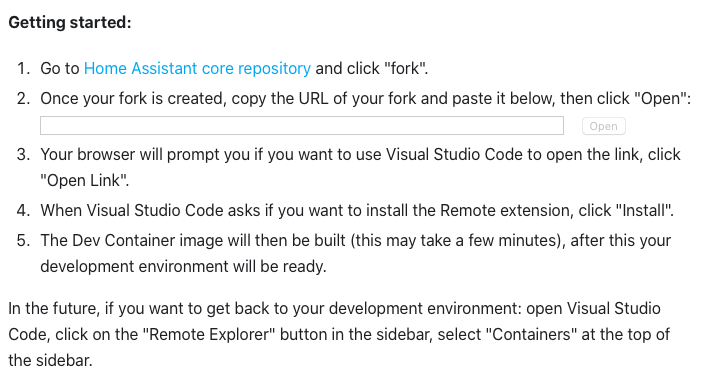
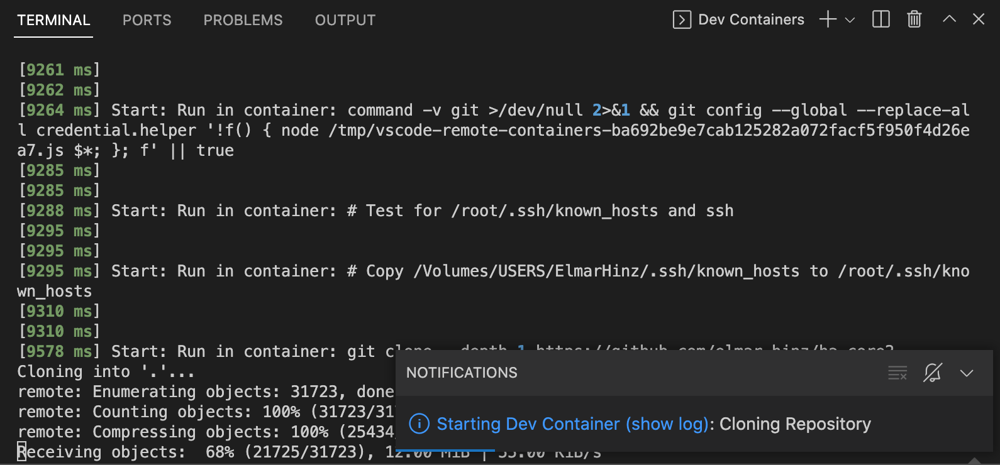
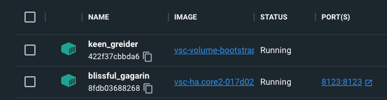
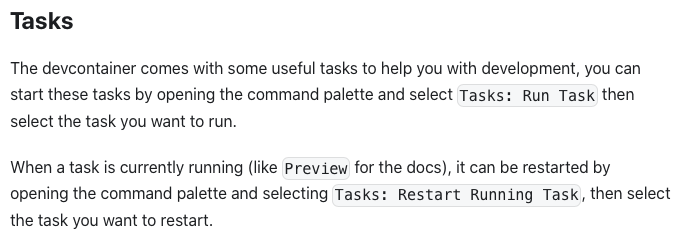
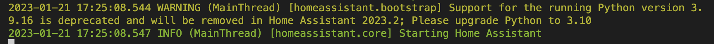
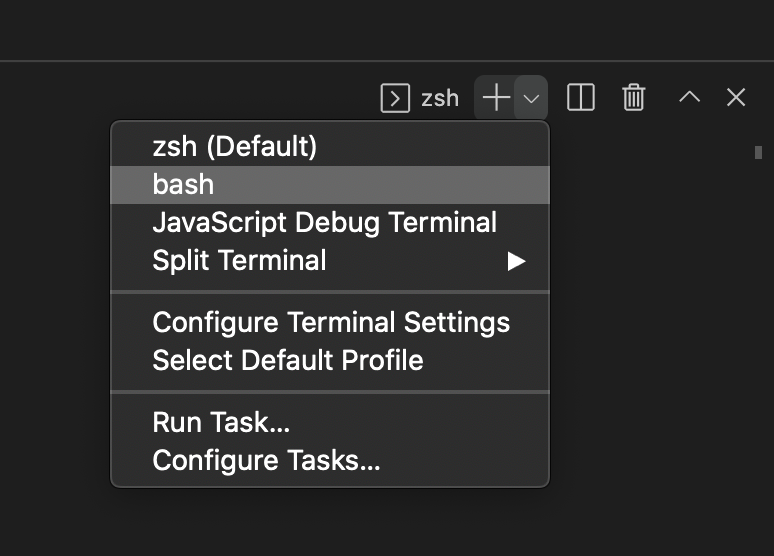
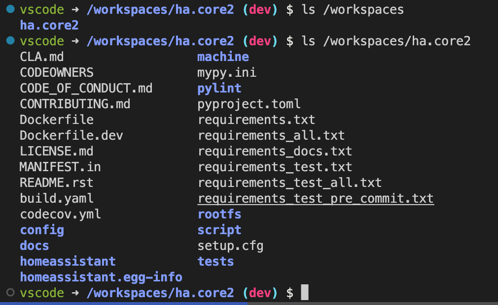
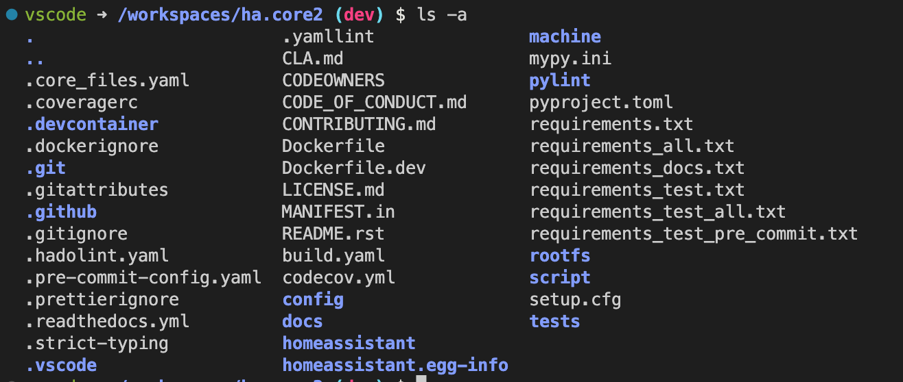
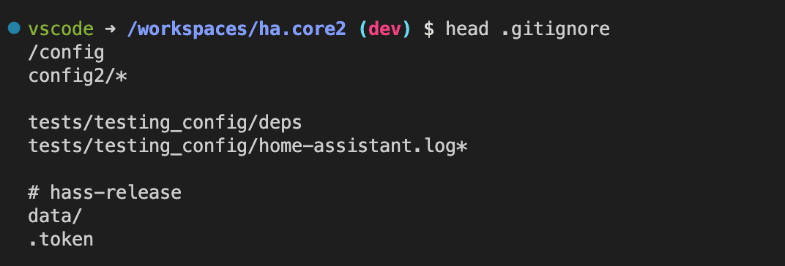

# Tutorial 01 - Home Assistant - The Development Environment

* @published: January 2023
* @author: Elmar Hinz

This repository is the first one of a series of tutorials addressing different
parts of the development with Home Assistant seen with the eye of the skilled
user. Each tutorial is shipped as a standalone github repository holding the
code alongside with the README (if any).

## The Development Environment

Today development is often done within *Docker containers* to get the same
environment for all developers. This is as useful to get the same environment
for all users of a tutorial. The recommended method to run Home Assistant itself
is based upon *Docker Containers*, the *"Home Assistant Operating System"*.

While there are different containers around, let's go directly into the lion's
den and use [the development container of the Home Assistant
core](https://github.com/home-assistant/core). It is well elaborated and most
likely up-to-date. Let's address the downside of this approach, too. It is a
large one. However, it is good to know the handling on the long run and you will
be able reuse this container for most of the future tutorials.

## Prerequisites

### Machine and Operating System

A contemporary machine being able to run *Docker* containers and *Visual Studio
Code*. Unix, Linux, Mac OS or Windows should be usable as Operating System
equally well.

### Internet access

Just to mention it.

### Docker

Docker should have been set up for your machine. You should know how to run it.

### Visual Studio Code

*VS Code* should have been set up for your machine and you should have figured
out how to use it.

The development container for core development is integrated with *VS Studio
Code*. It does automate most of the setup for you. There is also a manual setup
and you may use other editors. I hold to *VS Code* for this tutorial. Vim users
will find a well done plugin with vim bindings in *VS Code* and they get the IDE
on top for free.

### Shell

Even within *VS Code* you should know how to use a shell. The container offers
*zsh* and *bash*.

### Git

You should know how to use *Git* on the command-line. While *VS Code* offers a
graphical interface to *Git* it is difficult to really understand the usage
without a fundamental background.

### Github account

You should have registered for a Github account to be able to fork your own
instances of different parts of the tutorial. You should have registered your
local machine for your Github account, to easily push and pull from the command
line.

### JavaScript

To follow along the tutorials you should have a basic experience with JavaScript
and understand it's implementation of the class concept.

### Python

Will depend upon the tutorial.

### Installation

Begin by setting up the container as instructed by [the documentation
here](https://developers.home-assistant.io/docs/development_environment). You
actually have to visit the page and to use the given form, for to start up your
container.



This may take a while depending upon your connections. Open the terminal window
at the bottom of *VS Code* to follow along the process of the installation.



In the dashboard of the *Docker Desktop* you can observe, how a bootstrapping
container is setting up the development container. 

_NOTE_: Please notice how the list of `known_hosts` is copied from `~/.ssh/`
of the local machine into the container. Be aware of this privacy issue before
sharing the container.



It gets a silly `NAME` assigned. In my case it is `blissful_gagarin`. You
recognize the container by the name of the `IMAGE`. It contains the name, which
you assigned to your fork on Github (here `ha.core2`). In the shell of your host
machine assign a meaningful name.

```sh
docker rename blissful_gagarin ha.tutorial
```



Follow the instructions to start Home Assistant. Open the command palette of *VS
Code*. Select `Tasks: Run Task`. Select `Run Home Assistant Core`. Follow along
the start up log in the terminal window, to check if everything goes well.



You can ignore a warning regarding the version of Python. Home Assistant wants
to support older versions to a certain extend. When time has come, the core team
will update the container.

In your browser go ahead to [http://localhost:8123](http://localhost:8123) or
whatever address your local machine set up to. Create an account for the
administrator as usual.

### Exploring the container

Open the terminal in the bottom of *VS Code*. Click the **down arrow** right
hand of the **plus** symbol. You can select a shell of your taste.



Note how the *zsh* shell ships a lot of popular aliases by typing `alias` in it.

Open the shell of your choice to explore the directory structure:



In `/workspaces` you find the repository you have cloned. 

Change into it and type `ls -a` to also list the hidden files.



Among a lot of other stuff, you find the local `.git/` repository and the
`.gitignore` file. You find the configuration directory of *VS Code* `.vscode`.
There is the `config/` directory for the customization of Home Assistant.

Explore `.gitignore`. Type `head .gitignore`. You also find it within the file
explorer of *VS Code* on the left hand side.



The most important line for us is the first one containing `/config`. You
observe, that the configuration directory is ignored by this repository. Your
can freely place your own git repositories into it without having to fear any
conflicts.

### Restarting the Container

When closing the remote connection the shutdown of the container is triggered
automatically. The remote connections also gets closed when quitting *VS Code*.

To restart *VS Code* inside the container the shortcut is to select it from the
menu with `File > Open Recent`. The default approach is the command `Remote
Explorer: Focus on Containers View`. Then right click the container and select
`Open Folder in Container`.

### Mounting

It is not necessary to mount your projects into the development container, but
you may want to do so. Without mounting them, you have to start up the container
first to access them. That's fine as long as it is your default workflow and you
push the code regularly into a repository outside of the container. You may
want to mount the projects to be able to access them with the full tool chain of
your desktop.

You may consider to mount the full `config/` directory. As you have already
observed, it is not empty. If you want to mount it you have to take care to copy
the files back into it. I choose a different approach for this tutorial and show
the mounting on a more fine-grained level.

In a future tutorial we will show how to create cards and ship them as HACS
repositories. HACS does install cards into `config/www/community`. Let's mount a
development workspace for tutorials alongside, that is to `config/www/tutor`.
Add the `mounts` entry to the json array in `.devcontainer/devcontainer.json`.
Replace `<WorkspaceOfCards>` with the full path to your local workspace of cards
and `<YourRepoName>` with the matching directory name inside your container.

```json
"mounts": [
  "source=/<WorkspaceOfCards>,target=/workspaces/<YourRepoName>/config/www/tutor,type=bind,consistency=cached"
]
```

Rebuild the container with the command `Dev Containers: Rebuild Container`.

Find the official documentation of the mount syntax
[here](https://code.visualstudio.com/remote/advancedcontainers/add-local-file-mount).

#### Trouble shouting

Did you put the `mounts` entry into the top level of the array?

Don't put it into `settings` or any other wrong location.

Are the paths right?

In doubt change into them and use `pwd` to spell out the full paths. Then use
copy and paste to keep them untouched.

#### Challenge

You changed the `devcontainer.json` file and you can push the change to your
personal git repository. That's one good reason to keep your own fork of it.

This commit would get into your way, if you would like to create a pull request
for the Home Assistant core. It doesn't matter for the tutorial, though. You can
work around this by using different branches of your repository.

It would even be better, if you could mount directories without having to touch
the official `devcontainer.json`. I don't know a solution so far. Maybe you can
figure out one and contribute the solution.
